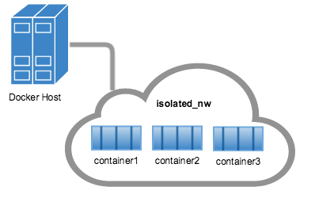
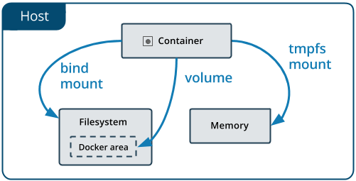

# Docker overview


#### The Docker platform

Docker provides the ability to package and run an application in a loosely isolated environment called a container. The isolation and security allow you to run many containers simultaneously on a given host. Containers are lightweight because they don't need the extra load of a hypervisor, but run directly within the host machine's kernel. This means you can run more containers on a given hardware combination than if you were using virtual machines. You can even run Docker containers within host machines that are actually virtual machines!


Docker provides tooling and a platform to manage the lifecycle of your containers:

- Develop your application and its supporting components using containers.
- The container becomes the unit for distributing and testing your application.
- When you're ready, deploy your application into your production environment, as a container or an orchestrated service. This works the same whether your production environment is a local data center, a cloud provider, or a hybrid of the two.


#### Docker Engine

*Docker Engine* is a client-server application with these major components:

- A server which is a type of long-running program called a daemon process (the `dockerd` command).
- A REST API which specifies interfaces that programs can use to talk to the daemon and instruct it what to do.
- A command line interface (CLI) client (the `docker` command).


#### What can I use Docker for?


**Fast, consistent delivery of your applications**

Docker streamlines the development lifecycle by allowing developers to work in standardized environments using local containers which provide your applications and services. Containers are great for continuous integration and continuous delivery (CI/CD) workflows.


Consider the following example scenario:

- Your developers write code locally and share their work with their colleagues using Docker containers.
- They use Docker to push their applications into a test environment and execute automated and manual tests.
- When developers find bugs, they can fix them in the development environment and redeploy them to the test environment for testing and validation.
- When testing is complete, getting the fix to the customer is as simple as pushing the updated image to the production environment.


**Responsive deployment and scaling**

Docker's container-based platform allows for highly portable workloads. Docker containers can run on a developer's local laptop, on physical or virtual machines in a data center, on cloud providers, or in a mixture of environments.

Docker's portability and lightweight nature also make it easy to dynamically manage workloads, scaling up or tearing down applications and services as business needs dictate, in near real time.


**Running more workloads on the same hardware**

Docker is lightweight and fast. It provides a viable, cost-effective alternative to hypervisor-based virtual machines, so you can use more of your compute capacity to achieve your business goals. Docker is perfect for high density environments and for small and medium deployments where you need to do more with fewer resources.


#### Docker Architecture


# Docker Machine


#### docker-machine commands
```bash
# For helps
$ docker-machine --help

# Start docker machine
$ docker-machine start

# Check docker machine status
$ docker-machine status

# SSH to docker machine
$ docker-machine ssh

# List docker machines
$ docker-machine ls

# Create a new docker machine
$ docker-machine create new-machine

# Choose a docker machine to use
$ eval $(docker-machine env new-machine)

# Check docker machine's IP address
$ docker-machine ip
```


# Docker images


Docker images have intermediate layers that increase reusability, decrease disk usage, and speed up `docker build` by allowing each step to be cached. These intermediate layers are not shown by default.


#### Docker image command
```bash
# List local images
$ docker image ls

# Inspect an image
$ docker image inpect nginx

# Show build history of an image
$ docker history nginx
```


#### Dockerfile
```dockerfile
# Use cetos:latest base image
FROM centos

# Update and install a package
RUN yum update -y && yum install -y net-tools

# Set an environment variable
ENV DATABASE_IP 192.168.100.100

# Create a new user
RUN useradd -ms /bin/bash kawamata

# Move into the new users home director
WORKDIR /home/kawamata

# Copy a tar file to the contaier and untar it
ADD add.tar .

# Copy a tar file to the container
COPY copy.tar .

# Download an exteral file
ADD http://www.namutech.co.jp/img/product/cocktail.png .

# Run a bash shell after the container starts
CMD bash
```


To prevent building a long Keep the codes that change the least at the top of the Dockerfile and keep the codes that changes the most at the bottom of the Dockerfile.


#### How to build docker images

```bash
# Build an image from the context. The image gets no name
# Default name Dockerfile will be used
$ docker build

# Build an image with specific file name
$ docker build -f /path/to/custom.Dockerfile

# Build an image with default dockerfile and tag the image
$ docker build -t curtis911/my-nginx .

# Build an image and tag the image with two different names
$ docker build -t curtis911/myapp:1.0.2 -t curtis911/myapp:latest .
```


# Docker Registry


There are two types of docker registries. One is hosted registry and the other one is private registry.


#### Hosted docker registry
- [DOCKER](https://hub.docker.com/)[HUB](https://hub.docker.com/)
  - Free, paid
  - Cloud service

- [QUAY.IO](https://quay.io/)
  - Free
  - Cloud service
  - On promise

- [ARTIFACTORY](https://www.jfrog.com/artifactory/)
  - Paid
  - Cloud service
  - On Promise


#### Open Source private registry

- [VMWare HARBOR](http://vmware.github.io/harbor/)
- [DOCKER REGISTRY](https://docs.docker.com/registry/deploying/)
- [docker/dockercloud-haproxy](https://github.com/docker/dockercloud-haproxy)


#### How to upload and download images

```bash
# Download an image from Docker Hub
# If no tag is specified, latest version will be downloaded
$ docker pull centos

# Downlad specific version
$ docker pull centos:centos7.6.1810

# Upload an image to Docker Hub
# An account is needed
$ docker push curtis911/my-nginx

# Remove the local image
$ docker image rm curtis/my-nginx
```


# Running Containers


#### Docker run command


"Docker run" command runs "docker create" and "docker start" commands at the same time. When the command is run, docker server looks for the image in the local cache and downloads if it does not exist. If an image tag is not provided "latest" tag is used.


#### Docker run command examples

```bash
# Basic docker run command format
$ docker run [OPTIONS] IMAGE [COMMAND] [ARG...]

# Run container without tagging the image
$ docker run centos:lastest

# List activate containers
$ docker container ls

# List all containers
$ docker container ls -a

# Run container with interactive mode
# Container stops after closing terminal
$ docker run -it centos

# # Run container with interactive mode in the background
# Container does not stop after closing terminal
$ docker run -itd centos
$ docker exec -it centos bash
```


# Docker API


Docker server communicates with clients over unix socket or http protocol.


#### How to communicate with docker server

```bash
# Display information for docker server and client
$ docker info

# Communicate over unix socket
# Run in the docker machine
$ curl --unix-socket /var/run/docker.sock -X GET http:/v1.24/images/json

# Communicate using authentications
$ curl https://192.168.99.100:2376/v1.24/images/json \
--cert "C:\Users\Curtis\.docker\machine\machines\default\cert.pem" \
--key "C:\Users\Curtis\.docker\machine\machines\default\key.pem" \
--cacert "C:\Users\Curtis\.docker\machine\machines\default\ca.pem"
```


# Docker Network


#### Four types of Docker network

- Standalone
  - Default bridge network
  - User-defined bridge network
- Host
- Overlay
- Macvlan


Containers can be connected to multiple networks.


#### Default Networks
When you install docker, the default network is created.
```bash
# List docker networks
$ docker network ls
NETWORK ID          	NAME	DRIVER
7fca4eb8c647         	bridge	bridge	# default bridge network
9f904ee27bf5         	none	null	# loopback only
cf03ee007fb4         	host	host	# shares the host network
```


#### Default bridge network

The default `bridge` network is present on all Docker hosts. If you do not specify a different network, new containers are automatically connected to the default `bridge` network. The default `bridge` network is not recommended for production.


#### How to use default bridge network
```bash
# Run the first container
$ docker run -itd --name=container1 busybox

# Run the second container
$ docker run -itd --name=container2 busybox

# Check containers' IP address
$ docker network inspect bridge

# Ping container2 from container1 by IP address
$ docker exec -it container1 ping -c 3 <container2 IP>

# Ping container2 from container1 by container name
$ docker exec -it container1 ping -c 3 container2
```





#### User-defined bridge network

It is recommended to use `user-defined bridge` networks to control which containers can communicate with each other, and also to enable automatic DNS resolution of container names to IP addresses.


#### How to use user-defined bridge network
```bash
# Create a new user-defined network
$ docker network create new-network

# Check if a new network is created
$ docker network ls

# Run the first container
$ docker run -itd --name=container1 --network new-network busybox

# Run the second container
$ docker run -itd --name=container2 --network new-network busybox

# Check containers' IP address
$ docker network inspect new-network

# Ping container2 from container1 by container name
$ docker exec -it container1 ping -c 3 container2
```


#### Host network
If a container is connected to the host network, it shares host's networking stack.


#### How to use host network
```bash
# Run a busybox container connected to the host network
$ docker run -it --rm --network host busybox

# Check the container's network interfaces
$ ip a

# Run a nginx container connected to the host network
$ docker run -d --name nginx --network host nginx

# Connect to the nginx web server
$ curl localhost
$ curl <other network interface IP>
```


#### None network
If you want to completely disable the networking stack on a container, you can use the `--network none` flag when starting the container. Within the container, only the loopback device is created. It is normally used for running batch jobs.


#### How to use none network
```bash
# Run a busybox container with the none network
$ docker run -it --rm --network none busybox

# Check the container's network interfaces
$ ip a
```


# Docker Volume


Docker provides three types of volume as below.

- **Volumes** are stored in a part of the host filesystem which is *managed by Docker* (`/var/lib/docker/volumes/` on Linux). Non-Docker processes should not modify this part of the filesystem. Volumes are the best way to persist data in Docker.
- **Bind mounts** may be stored *anywhere* on the host system. They may even be important system files or directories. Non-Docker processes on the Docker host or a Docker container can modify them at any time.
- **`tmpfs` mounts** are stored in the host system's memory only, and are never written to the host system's filesystem.





#### How to use volume
```bash
# Create a new volume
$ docker volume create nginx

# Inspect the volume created
$ docker volume inspect nginx

# Create a index.html file in the volume
$ echo "<h1>Volume Test</h1>" > index.html

# Run a nginx container using the volume
$ docker -d --name nginx1 -p 8000:80 -v nginx:/usr/share/nginx/html
$ docker -d --name nginx2 -p 8001:80 -v nginx:/usr/share/nginx/html

# Check the web page with curl command or web browser
$ curl localhost:8000
$ curl localhost:8001
```


#### How to use bind mount
```bash
# Create a new directory on the host machine
$ mkdir -p /var/www

# Create a index.html file in the volume
$ echo "<h1>Bind Mount Test</h1>" > /var/www/index.html

# Run a nginx container using bind mount
$ docker run -d --name nginx3 -p 8002:80 -v /var/www:/usr/share/nginx/html

# Check the web page with curl command or web browser
$ curl localhost:8002
```


#### How to user tmpfs
```bash
# Run a container without any volumes mounted
$ docker run -d --name no-volume nginx

# Create files in the /tmp directory
$ docker exec -it no-volume bash -c 'touch /tmp/file1 /tmp/file2 && ls -ltr /tmp'

# Restart the container
$ docker restart no-volume

# Check if the files still exists
$ docker exec -it no-volume ls -ltr /tmp

# Run a container with tmpfs mounted on /tmp
$ docker run -d --name tmpfs --mount type=tmpfs,destination=/tmp nginx

# Create files in the /tmp directory
$ docker exec -it tmpfs bash -c 'touch /tmp/file1 /tmp/file2 && ls -ltr /tmp'

# Restart the container
$ docker restart tmpfs

# Check if the files still exists
$ docker exec -it tmpfs ls -ltr /tmp
```


# Docker Compose


Compose is a tool for defining and running multi-container Docker applications. With Compose, you use a YAML file to configure your application's services. Then, with a single command, you create and start all the services from your configuration.


#### How to use Compose

Using Compose is basically a three-step process:

1. Define your app's environment with a `Dockerfile` so it can be reproduced anywhere.
2. Define the services that make up your app in `docker-compose.yml` so they can be run together in an isolated environment.
3. Run `docker-compose up` and Compose starts and runs your entire app.


#### Creating a `Dockerfile`
```dockerfile
# Use python:3 base image
FROM python:3

# Set an environment variable
ENV PYTHONUNBUFFERED 1

# Create a project root directory
RUN mkdir /code

# Cd to the project root directory
WORKDIR /code

# Copy the local file to the container
ADD requirements.txt /code/

# Install necessary python package
RUN pip install -r requirements.txt

# Copy the current directory to the container directory
ADD . /code/
```


#### Creating a `requirements.txt`
```python
Django>=1.8,<2.0
psycopg2
```


#### Creating a `docker-compose.yml`
```yaml
version: '3'

services:
  # Service name can be used like a hostname
  db:
    # Uses postgres image
    image: postgres
  web:
    # Build an image with default Dockerfile
    build: .
    # Runs the command when the container starts
    command: python3 manage.py runserver 0.0.0.0:8000
    volumes:
    # Mount the current directory over the container's /code directory
    - .:/code
    ports:
    # Port mapping for the port 8000 on the host to the port 8000 on the container
    - "8000:8000"
    depends_on:
    # Wait for the db container to start servicing
    - db
```


#### Creating a Django project
```bash
# This command runs the container and creates a new project in the volume
$ sudo docker-compose run web django-admin.py startproject django_project .
```


#### Connecting the database
```python
# Modify settings.py
DATABASES = {
    'default': {
        'ENGINE': 'django.db.backends.postgresql',
        'NAME': 'postgres',
        'USER': 'postgres',
        'HOST': 'db',
        'PORT': 5432,
    }
}
```


#### Run the `docker-compose up` command
```bash
$ docker-compose up
```