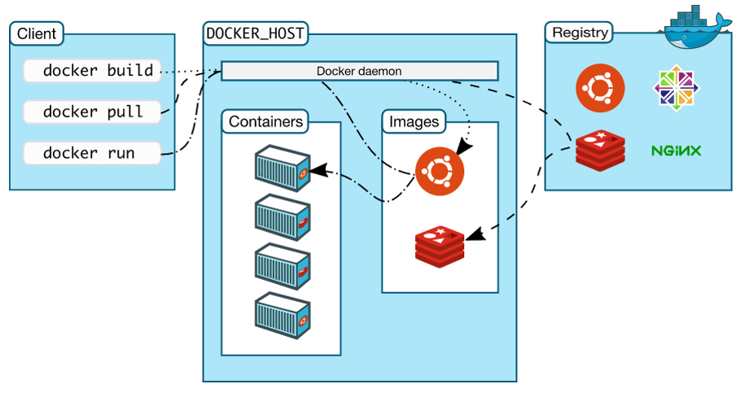

# About Docker


#### Docker Architecture



# Docker Machine


#### docker-machine commands
```bash
# For helps
docker-machine --help

# Start docker machine
docker-machine start

# Check docker machine status
docker-machine status

# SSH to docker machine
docker-machine ssh

# List docker machines
docker-machine ls

# Create a new docker machine
docker-machine create new-machine

# Choose a docker machine to use
eval $(docker-machine env new-machine)

# Check docker machine's IP address
docker-machine ip
```


# Docker images


#### Dockerfile
```dockerfile
# Use cetos:latest base image
FROM centos
# Set an environment variable
ENV DATABASE_IP 192.168.100.100
# Create a new user
RUN useradd -ms /bin/bash kawamata
# Move into the new users home director
WORKDIR /home/kawamata
# Copy a tar file to the contaier and untar it
ADD add.tar .
# Copy a tar file to the container
COPY copy.tar .
# Download an exteral file
ADD http://www.namutech.co.jp/img/product/cocktail.png .
# Run a bash shell after the container starts
CMD bash
```


#### How to build docker images

```bash
# Build an image from the context. The image gets no name
# Default name Dockerfile will be used
docker build

# Build an image with specific file name
docker build -f /path/to/custom.Dockerfile

# Build an image with default dockerfile and tag the image
docker build -t curtis911/my-nginx .

# Build an image and tag the image with two different names
docker build -t curtis911/myapp:1.0.2 -t curtis911/myapp:latest .
```


# Docker Registry


There are two types of docker registries. One is hosted registry and the other one is private registry.


#### Hosted docker registry
- [DOCKER](https://hub.docker.com/)[HUB](https://hub.docker.com/)
  - Free, paid
  - Cloud service

- [QUAY.IO](https://quay.io/)
  - Free
  - Cloud service
  - On promise

- [ARTIFACTORY](https://www.jfrog.com/artifactory/)
  - Paid
  - Cloud service
  - On Promise


#### Open Source private registry

- [VMWare HARBOR](http://vmware.github.io/harbor/)
- [DOCKER REGISTRY](https://docs.docker.com/registry/deploying/)
- [docker/dockercloud-haproxy](https://github.com/docker/dockercloud-haproxy)


#### How to upload and download images

```bash
# Download an image from Docker Hub
# If no tag is specified, latest version will be downloaded
docker pull centos

# Downlad specific version
docker pull centos:centos7.6.1810

# Upload an image to Docker Hub
# An account is needed
docker push curtis911/my-nginx

# Remove the local image
docker image rm curtis/my-nginx
```


# Running Containers


Docker server communicates with clients over unix socket or http protocol.


#### How to communicate with docker server

```bash
# Display information for docker server and client
docker info

# Communicate over unix socket
# Run in the docker machine
curl --unix-socket /var/run/docker.sock -X GET http:/v1.24/images/json

# Communicate using authentications
curl https://192.168.99.100:2376/v1.24/images/json \
--cert "C:\Users\Curtis\.docker\machine\machines\default\cert.pem" \
--key "C:\Users\Curtis\.docker\machine\machines\default\key.pem" \
--cacert "C:\Users\Curtis\.docker\machine\machines\default\ca.pem"
```


#### Docker run command


"Docker run" command runs "docker create" and "docker start" commands at the same time. When the command is run, docker server looks for the image in the local cache and downloads if it does not exist. If an image tag is not provided "latest" tag is used.


#### Docker run command examples

```bash
# Basic docker run command format
docker run [OPTIONS] IMAGE [COMMAND] [ARG...]

# Run container without tagging the image
docker run centos:lastest

# List activate containers
docker container ls

# List all containers
docker container ls -a

# Run container in an interactive mode
docker run -it centos 
```